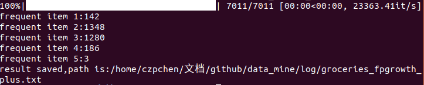
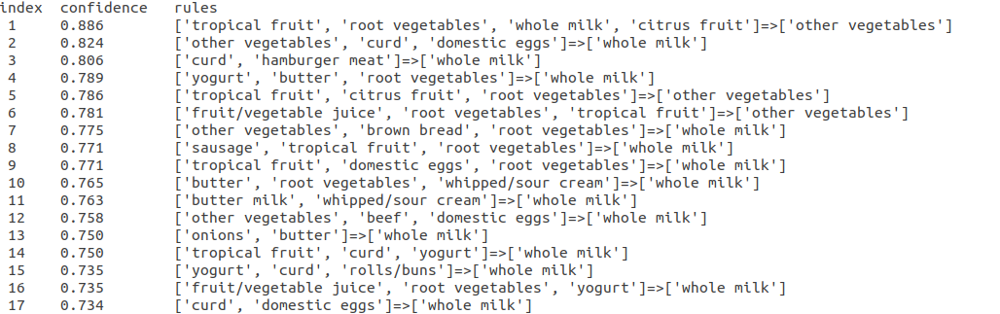
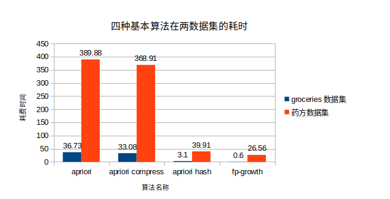
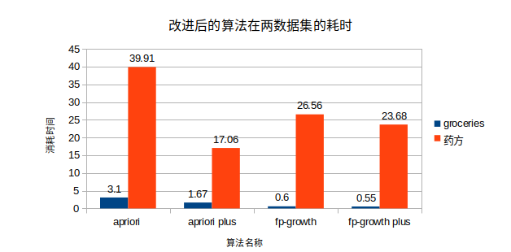

# data_mine

求star！求star！求star！

## introduce
In this repository implemente 6 class of Association rule data mining algorithm


1.Apriori (apriori.py)
>apriori algorithm

2.Apriori_compress(apriori_compress.py)
>transaction compression processing for apriori algorithm

3.Apriori_hash(apriori_hash.py)
>hash method for apriori algorithm

4.Apriori_plus(apriori_plus.py)
>transaction compress + dataset compress+hash + apriori

5.Fp_growth(fp_growth.py)
>fp-growth algorithm

6.Fp_growth_plus(fp_growth_plus.py)
> dataset compress + fp_growth

- running progress



- the result of association rule data mining



## how to use
-   download the repository
```
git clone https://github.com/blackAndrechen/data_mine
```
- into this folder 
```
cd data_mine
```

- write your own code,take apriori algorithm for example 
```
from apriori import *

data=[[l1,l2,l3,l4],
	  [l1,l3,l5],
	  [l1,l3,l4]]
min_support=2
min_confident=0.6

apr=Apriori()
rule_list=apr.generate_R(data,min_support,min_confident)
```
## tips
- if you want use others algorithm,the use method is same,for example
```
from fp_growth import *
fp=Fp_growth()
rule_list=fp.generate_R(data,min_support,min_confident)
``` 
- in my code ,i use `groceries.csv`and`药方.xls`data file,you can try running it
```
filename="groceries.csv"
min_support=25
min_conf=0.7

# filename="药方.xls"
# min_support=600
# min_conf=0.9
import os
current_path=os.getcwd()
path=current_path+"/dataset/"+filename
#path='/home/czpchen/文档/github/data_mine/dataset/groceries.csv'

data=load_data(path)
apr=Apriori()
rule_list=apr.generate_R(data,min_support,min_conf)
```
- if you want use youself dataset,suggest you rewrite a function to read youself dataset,And make sure your data set looks like this.
```
data=[[l1,l2,l3,l4],
	  [l1,l3,l5],
	  [l1,l3,l4]]
```
- if you want save the result of Association rule data
```
save_path=save_path=current_path+"/log/"+filename.split(".")[0]+"_apriori.txt"
#save_path='/home/czpchen/文档/github/data_mine/log/groceries_apriori.txt'

save_rule(rule_list,save_path)
```

## Performance analysis
simple analyse of my dataset







## Reference
[数据挖掘 第三版](https://book.douban.com/subject/11542972/)